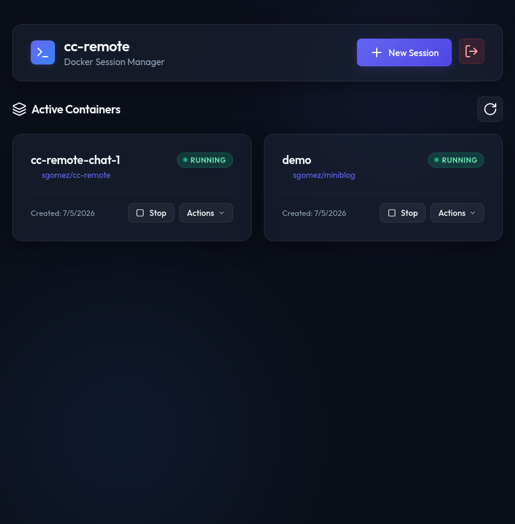
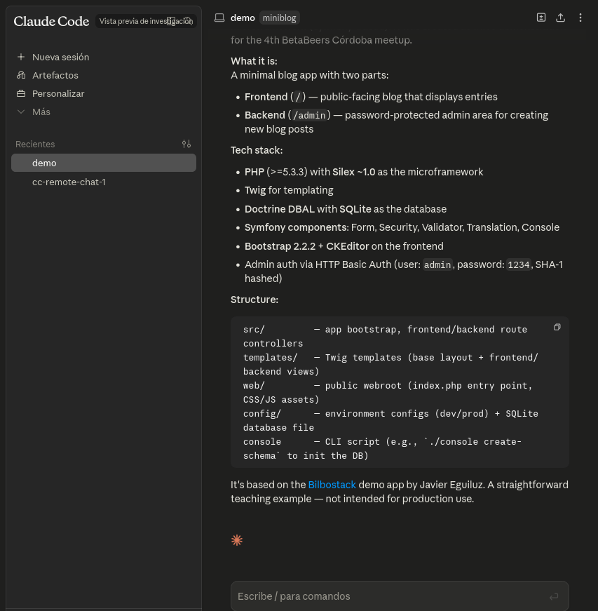

# Claude Code Remote Session Manager (VPS Setup)

This project provides a fully configurable Docker setup to run [Claude Code](https://github.com/anthropics/claude-code) with **Remote Control** enabled on a Virtual Private Server (VPS). It includes transparent GitHub authentication, Git identity mapping, and automated session backups.

<p align="center">
  
  
</p>

> [!WARNING]
> The `main` branch is under active development and may be unstable. For deployment, use the latest tagged release (currently `v0.1.0`) instead of `main` — see [Getting Started](#1-install-or-download-on-vps).

---

## Features

- **Multi-Session Web Manager:** A beautiful, responsive glassmorphic dark-mode web portal to create, start, stop, and destroy sibling Claude Code container sessions on-demand.
- **GitHub OAuth & ACL Security:** Exposes the web manager securely behind a single-button "Sign In with GitHub" login flow, restricting access to whitelisted accounts specified in `ALLOWED_GITHUB_USERS`.
- **Automatic HTTPS reverse proxy:** Includes Caddy to automatically provision Let's Encrypt SSL certificates and proxy incoming traffic on ports 80/443 directly to the web portal.
- **Sandboxed Workspaces (Volumes):** Each session is allocated an isolated Docker volume for its workspace, cloned automatically from GitHub on startup. Deleting a session gives you the option to wipe the volume to conserve space.
- **VPS-Ready:** Easily host your Claude Code agent on any Linux VPS.
- **Secure GitHub Auth:** Uses the dynamically obtained GitHub OAuth token to authenticate git clone/push/pull commands transparently, avoiding exposing SSH keys inside the container.
- **Dockerized Sandbox:** Runs in an isolated Docker container with essential tools (`git`, `curl`, `gh` CLI).
- **Auto Mode Integration:** Configured to run in Claude's Auto Mode (`--permission-mode auto`) by default, utilizing an AI safety classifier to auto-approve safe tasks and eliminate prompt fatigue.

- **User Identity Adapter:** Dynamically maps the running container user (UID/GID) to match your host system user. This prevents files created by the agent inside the shared `/workspace` from being owned by `root` on the host.
- **Session & Connection Persistence:** Configures a persistent session name (defaults to the repository name) and an optional unique static UUID, allowing your Remote Control session connection to persist across container re-creations without re-pairing.
- **Interactive Config-Backed Setup:** A clean configuration setup (`setup.sh` + `config.js`) verifies host paths, writes to a schema-validated `config.json`, and compiles variables to `.env` automatically.
- **Auto-Restore Session:** Restores the Claude authentication state from the host machine backups (`.claude.json`) if it gets lost during container recreation.

---

## Prerequisites

Ensure the following tools are installed and configured on your VPS host machine:

- **Docker** and **Docker Compose**
- **Git**
- **Claude Code CLI (`@anthropic-ai/claude-code`) — only for `claude-local`**: This is **optional**. It is required only if you want to run the `claude-local` Account, which bind-mounts the host's `~/.claude` / `~/.claude.json` into sessions. In that case, install the Claude Code client on your VPS host and authenticate (by running `claude` and completing the login) under the same user account that will execute the containers. A deployment that uses only API-key or OAuth Accounts (created later in the web UI) needs no host Claude config at all.
- A **GitHub OAuth Application**:
  - To enable "Sign In with GitHub", you must register an OAuth application on your GitHub developer settings page: [GitHub OAuth Apps](https://github.com/settings/developers).
  - Configure the application:
    - **Homepage URL**: `https://<your-vps-domain>` (or `http://localhost:4000` for local test)
    - **Authorization callback URL**: `https://<your-vps-domain>/api/auth/callback/github` (or `http://localhost:4000/api/auth/callback/github` for local test)
  - Copy the generated **Client ID** and **Client Secret** keys to use during the configuration wizard.

---

## Getting Started

### 1. Install or Download on VPS

Choose one of the following methods to deploy the codebase to your VPS:

> **Note:** `main` is the active development branch and may be unstable. For a stable deployment, use the latest tagged release (currently `v0.1.0`) as shown below.

#### Option A: Clone the Repository (Recommended)
If you have Git installed on your VPS, clone the latest stable release directly:
```bash
git clone --branch v0.1.0 https://github.com/sgomez/cc-remote.git
cd cc-remote
```

#### Option B: Download as a ZIP Archive
If you do not want to configure Git on your VPS, download and extract the ZIP archive for the latest stable release:
```bash
curl -L -o cc-remote.zip https://github.com/sgomez/cc-remote/archive/refs/tags/v0.1.0.zip
unzip cc-remote.zip
cd cc-remote-0.1.0
```

#### Updating / Overwriting an Existing Installation
When a new version is released, you can overwrite the previous one while preserving your settings (`config.json` and `.env`, which are ignored by Git and not part of the source):

* **If you cloned via Git:**
  ```bash
  git fetch --tags
  git checkout v0.1.0
  docker compose down
  docker compose up -d --build
  ```

* **If you downloaded via ZIP:**
  ```bash
  # Download the latest release archive
  curl -L -o cc-remote-new.zip https://github.com/sgomez/cc-remote/archive/refs/tags/v0.1.0.zip
  
  # Extract and overwrite the files (unzip -o overwrites existing files without prompting)
  unzip -o cc-remote-new.zip
  rm cc-remote-new.zip
  
  # Rebuild and restart the container
  docker compose down
  docker compose up -d --build
  ```

---

### 2. Configure and Prepare

Run the interactive setup script:
```bash
./setup.sh
```

This script runs the interactive setup wizard (`config.js`) inside a temporary Node Docker container to query your VPS settings, validate paths, generate a schema-validated **`config.json`**, and compile the **`.env`** file automatically.

During setup, you will be prompted for:
- Whether to enable the **Caddy** reverse proxy.
- Your **VPS Domain Name** (e.g., `cc.example.com` or `localhost:4000`).
- The **Caddy HTTP and HTTPS ports** (if Caddy is enabled, HTTP can be disabled with port `0`).
- Your **GitHub OAuth Client ID**.
- Your **GitHub OAuth Client Secret**.
- Whitelisted GitHub usernames (`ALLOWED_GITHUB_USERS`, comma-separated) allowed to access the system (e.g. `sgomez`).

Note that:
- The script automatically outputs a link and a step-by-step console guide to register the GitHub OAuth Application correctly based on the domain you enter.
- Paths for the project directory, Claude configuration directory (`~/.claude`), and session credentials file (`~/.claude.json`) are resolved automatically.
- Git identity (name and email) is automatically resolved from your host's global Git settings or falls back to defaults.

### 3. Run the Container

If you did not opt to launch the container automatically at the end of `setup.sh`, you can build and start it manually:

```bash
docker compose up -d --build
```

### 4. Check Logs and Authenticate

If you followed the prerequisites and logged in to Claude on your VPS host (`claude` or `claude login`), your authentication state (`~/.claude.json`) is mounted automatically, and the agent will start authenticated.

Otherwise, if you need to authenticate inside the container, view the container logs to find the authentication URL:

```bash
docker compose logs -f
```

Click the provided URL, sign in with your Anthropic account, copy the authentication token, and execute it into the container (if the remote control asks for it), or ensure your host configuration (`~/.claude.json`) is correctly populated under the same user running the docker commands.

---

## Web Manager & Multi-Session Portal

The project features a built-in web management interface (`web-manager` service) proxy-routed securely behind Caddy. It allows you to dynamically spin up, start, stop, and destroy Claude Code container sessions from your browser, each with a built-in web terminal. Each session gets its own isolated Docker volume and workspace sandbox.

The `web-manager` is a self-contained TanStack Start + Nitro app (`webapp/`) built into a single Node 24 image serving the UI, API, SSE status streams and the terminal WebSocket proxy on one port (4000).

### Deployment flow

1. `./setup.sh` — the wizard collects **infrastructure** only (domain, GitHub OAuth app, allow-list, optional claude-local paths, PUID/PGID) and compiles `.env`. It generates a stable `BETTER_AUTH_SECRET`. It does **not** ask about providers/accounts — those are created later in the UI.
2. `docker compose up -d --build` — brings up `caddy` + `docker-socket-proxy` + `web-manager`. On start the container validates its environment (failing fast and listing every problem if misconfigured) and applies database migrations idempotently.
3. Open the web UI, sign in with GitHub, and **create Accounts** (API-key providers like DeepSeek/custom, an OAuth `claude` Account, or the optional `claude-local` singleton). Then create Sessions against an Account.

Accounts and login sessions are stored in **SQLite** on the persisted `cc-remote-db` Docker volume, so they survive `docker compose down && up`. Per-Account Claude configuration lives in its own `cc-remote-account-<id>` volume. There is no on-disk provider config file — everything provider/account related lives in the database.

### Accessing the Web Manager

1. Open your browser and navigate to `https://<your-vps-domain>` (or `http://localhost:4000` for local test environments).
2. Click **Sign In with GitHub**.
3. Authorize the application. The backend verifies your GitHub username against the whitelisted `ALLOWED_GITHUB_USERS` (fail-closed: an empty list denies everyone). If allowed, a secure session cookie is created.

### Sibling Container Architecture

To avoid heavy nesting, performance hits, and security vulnerabilities associated with Docker-in-Docker (DinD), this project uses a **Sibling Containers** architecture:
- The `web-manager` container never mounts the raw Docker socket. It talks to the host daemon through the read-only `docker-socket-proxy` over TCP (`tcp://docker-socket-proxy:2375`), and therefore runs unprivileged.
- When you create a Session, the web manager calls the Docker API to create and start a sibling container running the `cc-remote-claude-agent` image, joined to the same `cc-remote` network so the terminal WebSocket proxy can reach it.
- Claude credentials come from the Session's **Account Config Volume** (API-key seeding or an OAuth login). `claude-local` is optional: only when configured does a Session bind-mount the host's `~/.claude` / `~/.claude.json`. A deployment with no host Claude config runs cleanly in API-key-only mode.

### Session Workspace Lifecycle

- **Isolation**: Each container session runs in isolation, mounting a dedicated Docker volume named `cc-remote-workspace-<session_name>`.
- **Auto-Cloning**: The entrypoint script automatically clones the specified GitHub repository into the empty volume on container startup.
- **Teardown**: When you delete a session from the web dashboard, you are prompted with a checkbox to also delete the associated workspace volume. Keeping the volume unchecked preserves the code state for future runs.
- **Dynamic GitHub Authentication**: The OAuth token obtained during your login is dynamically injected as the `GITHUB_TOKEN` environment variable in the dynamically generated Claude Code session containers, allowing seamless access to clone, fetch, and pull all repositories (personal and organizational) you have access to in your account.

---

## Management Commands

| Action | Command |
|---|---|
| **Start in background** | `docker compose up -d` |
| **Stop container** | `docker compose down` |
| **View logs** | `docker compose logs -f` |
| **Rebuild container** | `docker compose build --no-cache` |
| **Open container terminal (web session)** | `docker exec -it cc-remote-session-<session_name> bash` |
| **Open container terminal (manual run)** | `docker compose --profile agent exec claude-agent bash` |

---


## Auto Mode & Container Sandboxing

By default, the container runs Claude Code in **Auto Mode** (`--permission-mode auto`).

### Why Auto Mode?
Auto Mode replaces routine permission prompts with a background safety classifier. This classifier evaluates pending tool actions and automatically approves safe operations (like reading or editing files in the workspace and running standard git operations) while blocking actions that appear destructive, irreversible, or outside the scope of your request. This significantly reduces "approval fatigue" during remote control sessions.

### Security & Isolation (The Sandbox)
Because the Claude Code agent runs entirely inside an isolated Docker container, the container acts as a secure sandbox. Any filesystem changes, commands, or tool executions occur within this sandbox and cannot access or modify the host VPS system files or configurations directly. This sandboxed architecture makes running in Auto Mode highly secure and safe.

### Customizing Auto Mode Rules
You can customize the classifier's behavior (e.g. telling it which repositories, buckets, or domains are trusted to avoid false-positive blocks on routine tasks) by defining an `autoMode` settings block in your user configuration.

Where to put this block depends on the Account:

- **`claude-local`** (host bind mount): the session mounts the host's Claude credentials file (`CLAUDE_JSON_PATH`, default `~/.claude.json`), so customize it directly in `~/.claude.json` on the host.
- **API-key / OAuth Accounts**: the configuration lives in that Account's own `cc-remote-account-<id>` volume (seeded at registration and, for OAuth, populated by the Login Container), edited from inside a session's web terminal.

Example block:

```json
{
  "permissions": {
    "defaultMode": "auto"
  },
  "autoMode": {
    "environment": [
      "$defaults",
      "Source control: github.com/your-org and all repos under it",
      "Trusted internal domains: *.internal.example.com"
    ]
  }
}
```

You can change the permission mode to other values (e.g., `default`, `acceptEdits`, `plan`, `dontAsk`, or `bypassPermissions` if you want to bypass prompts entirely in your sandbox) by setting the `PERMISSION_MODE` environment variable in your `.env` or during the interactive `./setup.sh` configuration.

---

## Custom Skills and Rules (.agents)

For custom agent instructions, workflows, or rules (such as TDD guidelines, code style rules, or custom skills) to be loaded and used by the agent inside the container, they must be located inside the project repository under the `.agents/` folder.

Since the container mounts your project repository to `/workspace`, the agent will automatically discover, load, and follow these rules and skills when it initializes.


