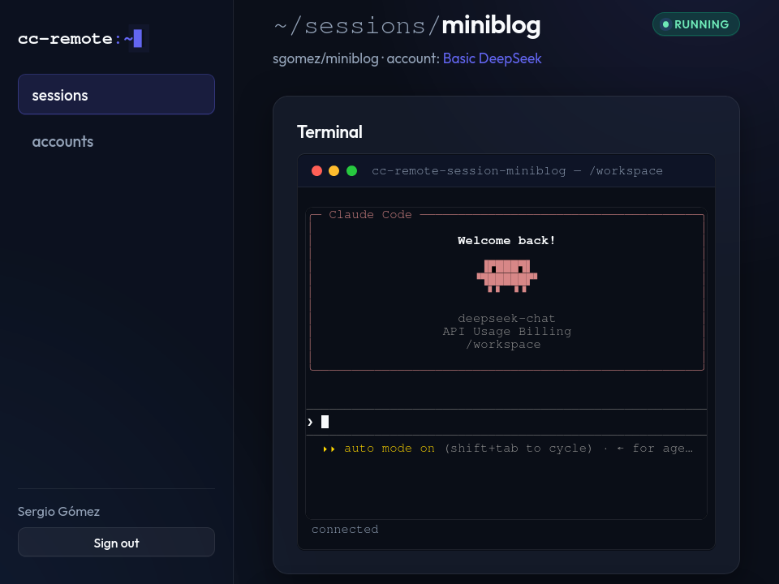
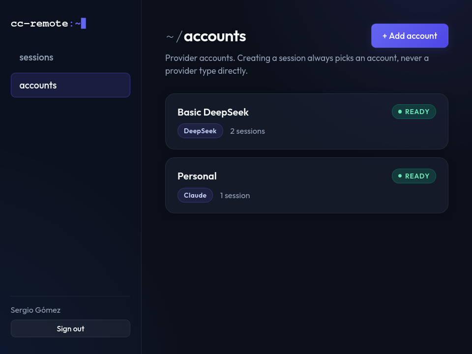

# Claude Code Remote Session Manager (Multi-Provider)

Run [Claude Code](https://github.com/anthropics/claude-code) with **Remote Control** on your own VPS, fully Dockerized, with Claude, DeepSeek, or any Anthropic-compatible model.

Sign in with GitHub, register an **Account** once, and spin up as many sandboxed agent **Sessions** as you like from the browser: each one its own container, its own cloned workspace, and its own built-in web terminal. Nothing is installed on the host but Docker; no agent container ever touches a host path.

**Not just Claude.** An Account can be your Claude subscription (OAuth login, with Remote Control), **DeepSeek**, or **any Anthropic-compatible endpoint**: you supply the API key, base URL and model. Run different Sessions on different providers side by side. Remote Control is a Claude feature; with the others you drive the agent from the web terminal (that is a DeepSeek session in the screenshot above).

<p align="center">
  
</p>

> [!WARNING]
> The `main` branch is under active development and may be unstable. Deploy the latest tagged release (currently `v1.0.0-alpha.1`), not `main`.

## Features

- **Multi-Session web manager**: create, stop, reset and destroy Claude Code containers from the browser, each with a built-in web terminal.
- **Accounts, not host credentials**: authenticate each Account once (interactive `claude` OAuth login in the browser, or an API key); credentials live in a Docker volume, never on the host.
- **Bring your own provider**: Claude, **DeepSeek**, or any **Anthropic-compatible endpoint** (your key, base URL and model). Sessions on different providers run side by side; Remote Control is Claude-only, the web terminal works with all of them.
- **Sandboxed workspaces**: every Session clones its GitHub repo into an isolated Docker volume.
- **GitHub sign-in with a fail-closed allow-list**: only the usernames you list get in; an empty list denies everyone.
- **Automatic HTTPS**: optional Caddy reverse proxy with Let's Encrypt.
- **Auto Mode with real isolation**: agents run `--permission-mode auto` inside locked-down containers with no host mounts, a split Docker network, and memory/CPU/PID caps. Read [Security & sandboxing](docs/security.md) before trusting it with anything.

<table>
  <tr>
    <td width="50%"></td>
    <td width="50%"></td>
  </tr>
</table>

## Quick start

You need a VPS with **Docker**, **Docker Compose** and **Git**, plus a **GitHub App** (takes a few minutes; the [install guide](docs/install.md#step-1-create-a-github-app) walks you through it). No Claude Code install on the host.

```bash
git clone --branch v1.0.0-alpha.1 https://github.com/sgomez/cc-remote.git
cd cc-remote
./setup.sh
```

The wizard asks for your domain, the GitHub App details and the allowed GitHub usernames, derives everything else, and offers to start the stack. If you skipped that last step:

```bash
docker compose up -d --build
```

Open `https://<your-domain>` (or `http://localhost:4000` locally), sign in with GitHub, register an **Account**, and create your first **Session**.

First time? Follow the **[step-by-step install guide](docs/install.md)**.

## Updating

Your settings (`config.json`, `.env`) are gitignored and survive updates, and running Sessions are left untouched:

```bash
git fetch --tags && git checkout v1.0.0-alpha.1
docker compose up -d --build
```

### Coming from v0.1.0

Don't migrate. Start clean. **Push any work you care about to GitHub first** (this deletes every workspace), then wipe everything cc-remote from Docker and set up again:

```bash
docker compose down -v
docker ps -aq --filter "name=cc-remote" | xargs -r docker rm -f
docker volume ls -q --filter "name=cc-remote" | xargs -r docker volume rm
docker network rm cc-remote 2>/dev/null || true
git fetch --tags && git checkout v1.0.0-alpha.1
./setup.sh
```

## Documentation

- **[Install guide](docs/install.md)**: every step spelled out, from the GitHub App to your first Session.
- **[User guide](docs/usage.md)**: Accounts, Sessions, the web terminal, day-to-day commands, and configuration.
- **[Security & sandboxing](docs/security.md)**: what makes Auto Mode acceptable here, and what it does *not* protect you from.
